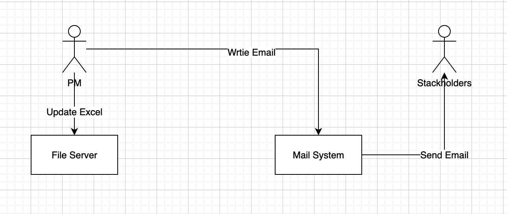
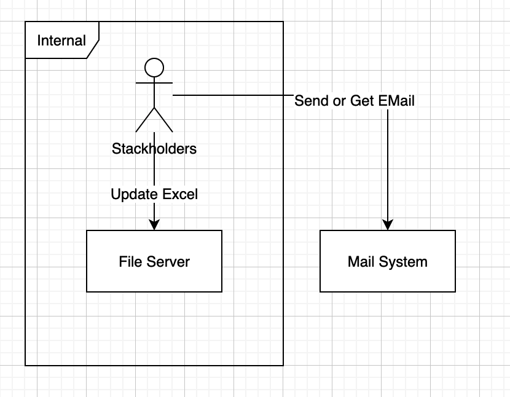
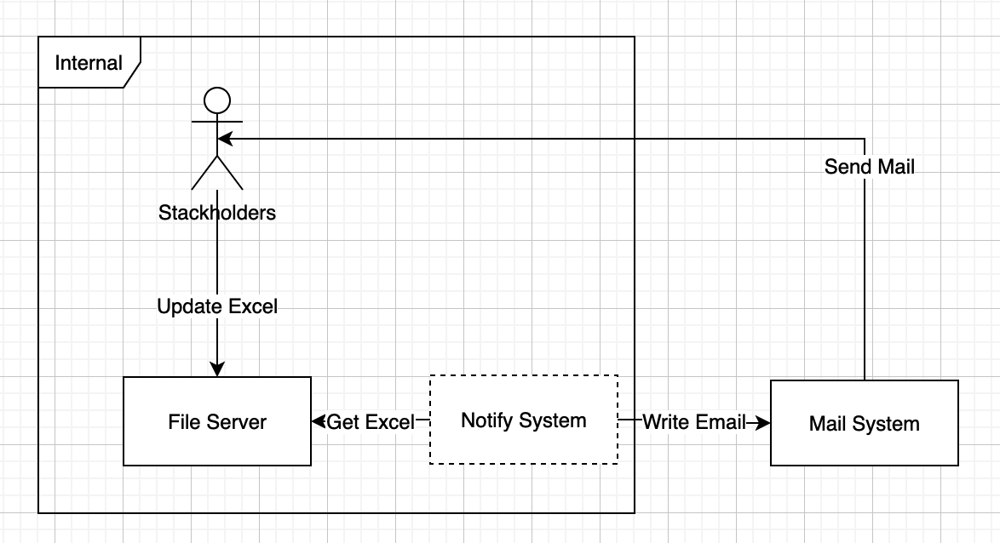
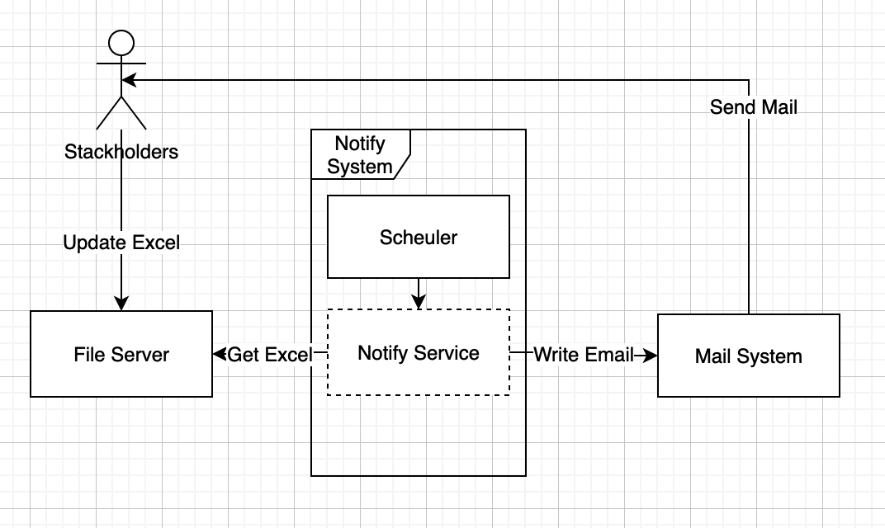
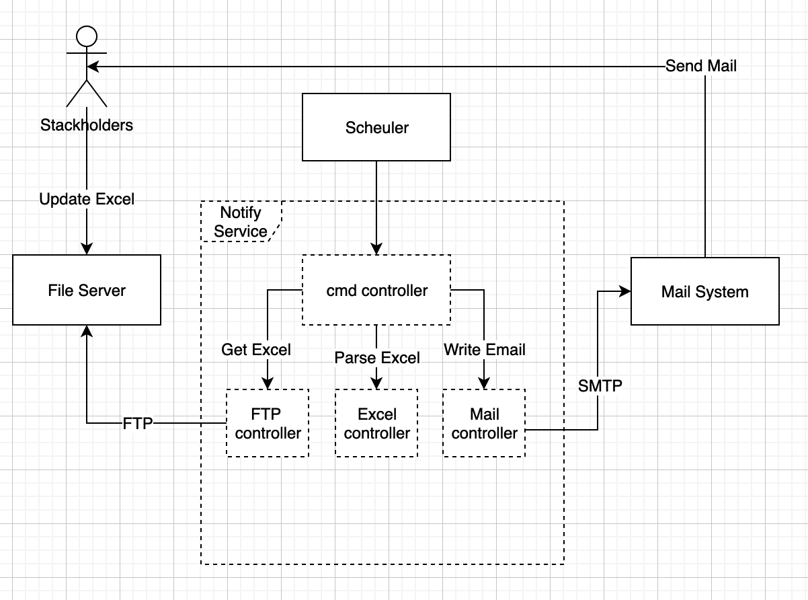
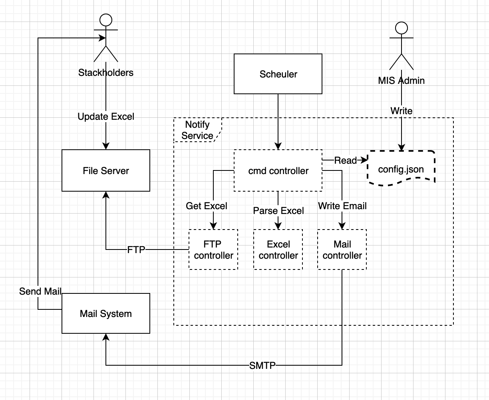

## 回應需求
1. Notify System需由系統管理員(MIS-A)安裝、設定。
2. Notify System必須每週提醒各成員還未完成的事項。

## C4-Model
* https://c4model.com/

### System Context - 現況


### System Context - 系統邊界


### System Context - 解決方案


### Container 
* Scheduler: 需設定排程，每週執行一次Notify Service
* Notify Service: 需實作開發。


### Componet 
* Notify Service需實作: cmd, FTP, Excel, Email 等component
* cmd controller: 接收指令，被呼叫後組織工作。
* FTP controller: FTP通訊協定、登入FTP、下載檔案
* Excel controller: 讀取Excel檔案、解析Row與Cell
* Email controller:  SMTP通訊協定、Send Email
* 僅說明關聯性，為說明「使用順序」

* 考慮到系統管理員這個角色


### Code 
1. load Config about FTP and Email
2. login to FTP server with Account Config
3. GET Excel from FTP server
4. parse Excel file
5. generate notification messages
6. send message via Mail System with Auth Config
```
可使用活動圖、循序圖、類圖等UML diagram表現
```

