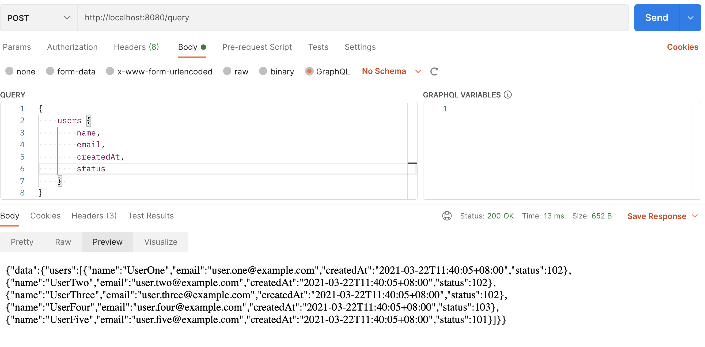
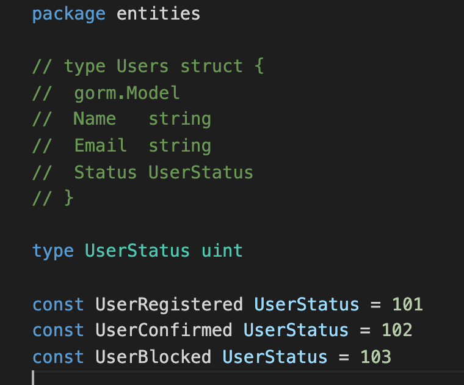
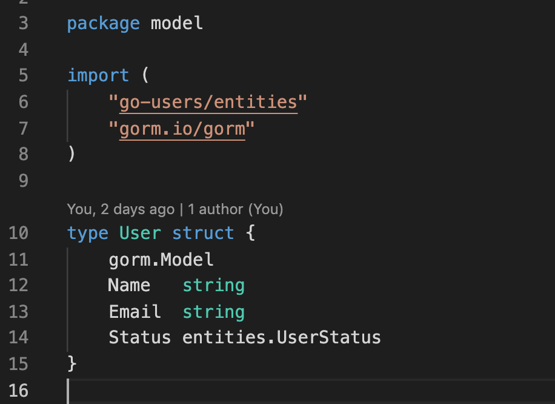

# graphql-server
using gorm, gin and gqlgen to implement a graphql server


## Original Web Server Architecture  
* Gin <-> Gorm <-> Database

## GraphQL Server Architecture
* TODO
 
## Build a API Server 
1. Gorm <-> Database
2. Gin <-> Gorm
3. Add GraphQL with gqlgen
4. 實現：查詢使用者清單，列出所有使用者資料。

### Gorm <-> Database
* 使用者資料表， entities.User
```
type User struct {
	gorm.Model
	Name   string
	Email  string
	Status entities.UserStatus
}
```
* 自動連結資料庫產生資料表與資料
```
gorm.DB.AutoMigrate(&entities.User{})
gorm.DB.Create(&entities.User{})
```

### Gin <-> Gorm
```
	dbMain = initDB() //產生資料庫連結實例
	r := gin.Default()
	r.GET("/users", getUsersHandler) //綁定路由與handler
	r.Run(":8080")    
```
``` 
// 實作handler
func getUsersHandler(c *gin.Context) {
	var users []model.User
	er := dbMain.Model(&users).Find(&users).Error //查詢資料庫
	if er != nil {
		c.JSON(http.StatusBadRequest, er)
		return

	}
	c.JSON(http.StatusOK, &users)
}
```

### Add GraphQL with gqlgen
1. 初始化GraphQL schema: `go run github.com/99designs/ `
2. 因GraphQL為schema first，因此要先比對原已存在的Gorm Models，如果型態無法直接對應，要增加在scalar段。
```
type User {
  id: ID!           
  name: String!
  email: String!
  createdAt: Time!
  updatedAt: Time!
  status: Any!
}

type Query {
  users: [User!]!
}

scalar Time // 對應到go的 time.Time型態
scalar Any // 對應到go的 interface{}型態
```
3. 因初始化的GraphQL schema為gqlgen提供的sample，因此修改`gqlgen.yml`或`schema.graphqls`後，要更新model、generated
```
go run github.com/99designs/gqlgen generate
```
4. 重新產生後model與entitis內定義的User struct結構不同
``` 
// model
type User struct {
	ID        string      `json:"id"`
	Name      string      `json:"name"`
	Email     string      `json:"email"`
	CreatedAt time.Time   `json:"createdAt"`
	UpdatedAt time.Time   `json:"updatedAt"`
	Status    interface{} `json:"status"`
}

// entities
type User struct {
	gorm.Model
	Name   string
	Email  string
	Status entities.UserStatus
}
```

5. 將entities.User覆蓋到model 

6. 將`gqlgen init`產生的graphqlHandler()搬移到main.go
```
func graphqlHandler() gin.HandlerFunc {
	// NewExecutableSchema and Config are in the generated.go file
	// Resolver is in the resolver.go file
	h := handler.NewDefaultServer(generated.NewExecutableSchema(generated.Config{Resolvers: &graph.Resolver{
		DB: dbMain, //給予資料庫連結
	}}))
	return func(c *gin.Context) {
		h.ServeHTTP(c.Writer, c.Request)
	}
}
```
7. 綁定 路由 與 graphqlHandler
``` 
r.POST("/query", graphqlHandler())
```
8. GraphQL Resolver需要連接資料庫，需要有gorm.DB屬性，因此要修改`resolver.go`
``` 
import "gorm.io/gorm"

type Resolver struct {
	DB *gorm.DB
}
```

### 實現：查詢使用者清單，列出所有使用者資料


### 備註：將entities.User覆蓋到model 
 
 